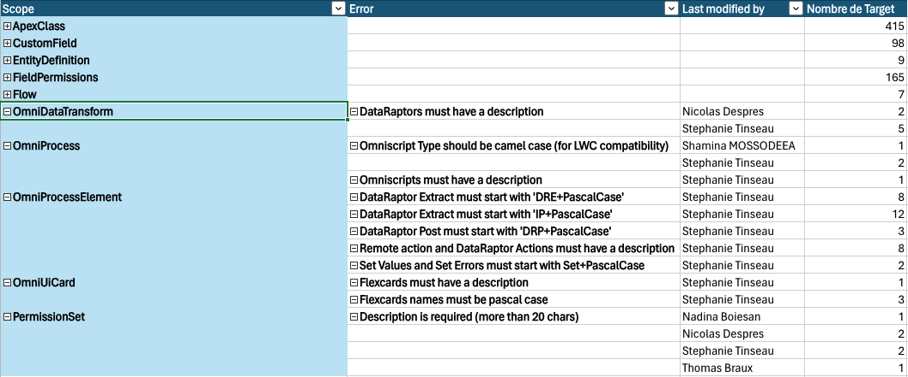

# SF Explorer Devops Rules

A set of declarative rules to validate best practices in your org:
 

## Pre-requisite
- nodejs
- sf or sfdx connected on a default org

## Running the rules

Run this command inside your sfdx repository:  
```cmd
npx @sf-explorer/devops.cli
```
The command will generate:
* an xml file named `testReport.xml` similar to the one you can find [here](./cli/test-report.xml)
* an csv file named `errors.csv`
* an json file named `errors.json`

## Customize the rules
You can ignore specific errors with a file named `.sfexplorerignore` (using regex similar to a .gitignore file)
- ignore an author with @ and the author name
- ignore a record with its type and target

## Default Rules

### EntityDefinition
[A custom object Name must be in english and PascalCase](./Sample%20Rules/EntityDefinition/index.md)  
[A custom object Description is required](./Sample%20Rules/EntityDefinition/index.md)  
[Less than 100 custom fields](./Sample%20Rules/EntityDefinition/index.md)  
[Maximum one custom trigger per object](./Sample%20Rules/EntityDefinition/index.md)  
[Maximum 15 record types per object](./Sample%20Rules/EntityDefinition/index.md)  

### CustomField
[A CustomField API Name must be in english and PascalCase](./Sample%20Rules/CustomField/index.md)  
[Custom Fields must have a Description (at least 20 chars)](./Sample%20Rules/CustomField/index.md)  

### Flow
[Flow Description is required (at least 20 chars)](./Sample%20Rules/Flow/index.md)  
[Flow Label must be Short Yet Meaningful](./Sample%20Rules/Flow/index.md)  

### ApexClass
[An Apex class name must be PascalCase and use a correct Suffix](./Sample%20Rules/ApexClass/index.md)  
[An ApexClass must follow the best practices](./Sample%20Rules/ApexClass/index.md)  
[An ApexClass must have a Description](./Sample%20Rules/ApexClass/index.md)  
[An ApexClass must have an author](./Sample%20Rules/ApexClass/index.md)  
[Apex variables must be camelCase](./Sample%20Rules/ApexClass/index.md)  
[Apex methods must be camelCase](./Sample%20Rules/ApexClass/index.md)  

### LightningComponentResource
[An LWC must have an author](./Sample%20Rules/LightningComponentResource/index.md)  
[An LWC must have a description](./Sample%20Rules/LightningComponentResource/index.md)  

### PermissionSet
[Name is following project convention](./Sample%20Rules/PermissionSet/index.md)  
[Description is required (more than 20 chars)](./Sample%20Rules/PermissionSet/index.md)  

### PermissionSetGroup
[PermissionSetGroup must have a description (more than 20 chars)](./Sample%20Rules/PermissionSetGroup/index.md)  

### CustomPermission
[CustomPermissions must have a description](./Sample%20Rules/CustomPermission/index.md)  

### FieldPermissions
[No field level security on Profiles (except System Administrator)](./Sample%20Rules/FieldPermissions/index.md)  

### OmniUiCard
[Flexcards names must be pascal case](./Sample%20Rules/OmniUiCard/index.md)  
[Flexcards must have a description](./Sample%20Rules/OmniUiCard/index.md)  

### OmniProcess
[Omniscript Type should be camel case (for LWC compatibility)](./Sample%20Rules/OmniProcess/index.md)  
[Omniscript SubType must be PascalCase](./Sample%20Rules/OmniProcess/index.md)  
[Omniscripts must have a description](./Sample%20Rules/OmniProcess/index.md)  
[Omniscript must have less than 100 elements](./Sample%20Rules/OmniProcess/index.md)  

### OmniProcessElement
[Remote action and DataRaptor Actions must have a description](./Sample%20Rules/OmniProcessElement/index.md)  
[Set Values and Set Errors must start with Set+PascalCase](./Sample%20Rules/OmniProcessElement/index.md)  
[Remote Action must start with 'Invoke+PascalCase'](./Sample%20Rules/OmniProcessElement/index.md)  
[DataRaptor Extract must start with 'DRE+PascalCase'](./Sample%20Rules/OmniProcessElement/index.md)  
[DataRaptor Post must start with 'DRP+PascalCase'](./Sample%20Rules/OmniProcessElement/index.md)  
[Integration Procedure must start with 'IP+PascalCase'](./Sample%20Rules/OmniProcessElement/index.md)  

### OmniDataTransform
[DataRaptors must have a description](./Sample%20Rules/OmniDataTransform/index.md)  

### ExternalString
[CustomLabel name must be PascalCase](./Sample%20Rules/ExternalString/index.md)  

### StaticResource
[StaticResource must have a description](./Sample%20Rules/StaticResource/index.md)  

### CustomApplication
[CustomApplication must have a description](./Sample%20Rules/CustomApplication/index.md)  

### ValidationRule
[ValidationRule must have a description](./Sample%20Rules/ValidationRule/index.md)  

### WebLink
[Custom Button must have a description](./Sample%20Rules/WebLink/index.md)  
[Custom Button name must be pascal case](./Sample%20Rules/WebLink/index.md)  

